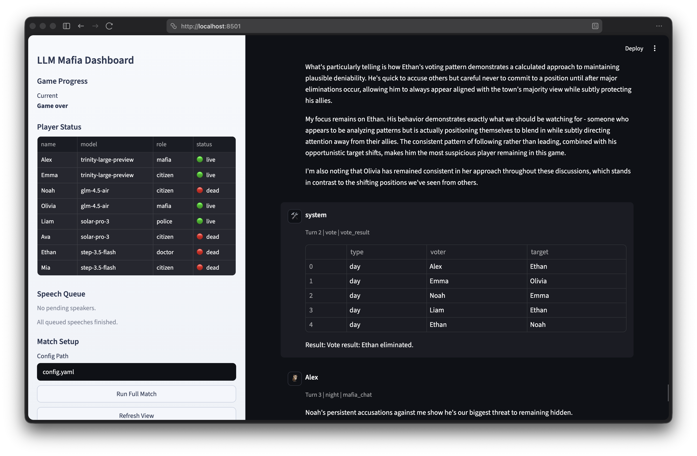
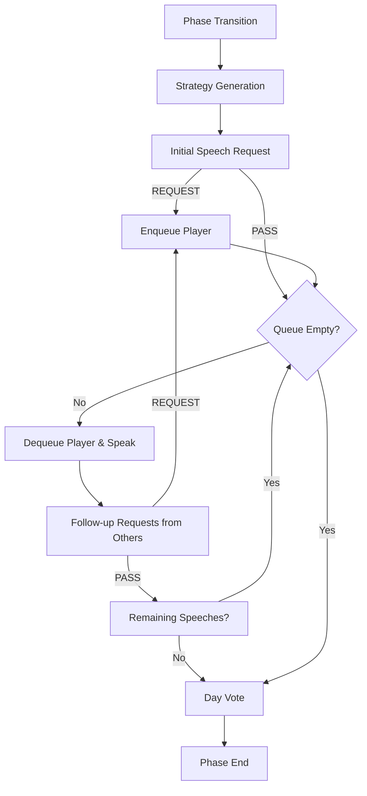

# LLM Mafia

An LLM-based Mafia game simulator where different language models play against each other in a classic game of deception and strategy.



## Overview

`llm-mafia` is a framework designed to evaluate and observe how different Large Language Models (LLMs) perform in a multi-agent social deduction game. The project supports various models through OpenRouter, allowing for diverse matchups and performance analysis.

## Key Features

- **Multi-Agent Simulation**: Watch multiple LLMs interact, debate, and vote in a Mafia game setting.
- **Realistic Debates with SpeechQueue**: Players request turns to speak through a queue system, simulating the flow of real-world discussions rather than simple turn-based responses.
- **Selectable Match Runners**: Use the default LangGraph-based runner or switch back to the legacy loop runner for parity checks.
- **Flexible Role Configuration**: Customize the number of Mafia, Police, Doctor, and Citizens.
- **Model Diversity**: Assign different LLM models to specific players to compare their strategic capabilities.
- **Deterministic Runs**: Support for random seeds to reproduce specific game scenarios.
- **Interactive Dashboard**: A Streamlit-based UI to visualize game progress, logs, and metrics.
- **Detailed Metrics**: Automated collection of game stats, including win rates and reasoning logs.

## Agent Pipeline

The following diagram illustrates how agents interact during a game round, highlighting the `SpeechQueue` mechanism for dynamic debates:



## Getting Started

### Prerequisites

- Python 3.13 or higher
- [uv](https://github.com/astral-sh/uv) (recommended for dependency management)

### Installation

1. Clone the repository:
   ```bash
   git clone https://github.com/your-username/llm-mafia.git
   cd llm-mafia
   ```

2. Install dependencies:
   ```bash
   uv sync
   ```

3. Set up environment variables:
   ```bash
   cp .env.sample .env
   ```
   Edit `.env` and add your `OPENROUTER_API_KEY`.

### Configuration

The game behavior and model assignments are managed via `config.yaml`.

```yaml
game:
    player_count: 8
    day_max_speeches_per_player: 2
    roles:
        mafia: 2
        police: 1
        doctor: 1
        citizen: 4

llm:
    provider: openrouter
    models:
        - name: nemotron-3-super
          model: nvidia/nemotron-3-super-120b-a12b:free
          count: 3
        - name: minimax-m2.5
          model: minimax/minimax-m2.5:free
          count: 3
        - name: step-3.5-flash
          model: stepfun/step-3.5-flash:free
          count: 2
```

## Usage

### Run a Single Match (CLI)

Execute a single game session and see the results in your terminal:

```bash
uv run main.py
```

Options:
- `--seed <int>`: Set a random seed for reproducibility.
- `--max-rounds <int>`: Limit the maximum number of game rounds.
- `--config <path>`: Specify a custom configuration file.
- `--runner {graph,legacy}`: Choose the match runner implementation. `graph` is the default.

Examples:

```bash
uv run main.py --runner graph
uv run main.py --runner legacy --seed 7 --max-rounds 10
```

### Run the Streamlit Dashboard

Launch the interactive UI to watch the game in real-time and explore logs:

```bash
uv run main.py --streamlit
```

## Project Structure

- `src/agents/`: Logic for LLM agents and role-specific personas.
- `src/engine/`: Game state management, voting, and phase transitions.
- `src/providers/`: LLM provider clients (OpenRouter).
- `src/metrics/`: Performance data collection and reporting.
- `src/runner/match_runner.py`: Dispatches between available runner implementations.
- `src/runner/graph_runner.py`: LangGraph-based match orchestration used by default.
- `src/runner/single_match.py`: Legacy loop-based runner kept for parity and fallback.
- `src/runner/tournament.py`: Multi-match tournament orchestration.
- `docs/rule.md`: Detailed game rules and mechanics.

## Development

### Testing

Run the test suite using `pytest`:

```bash
uv run pytest -q
```

## License

This project is licensed under the MIT License - see the LICENSE file for details.
